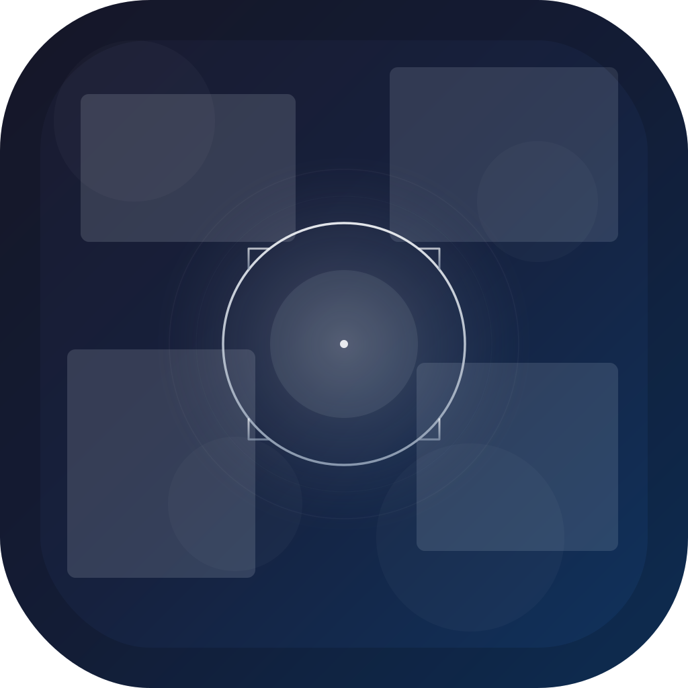

<div align="center">



# FocusBlur

### Noise-cancelling for your screen.

A featherweight macOS app that blurs every window except the one you're working in.<br>
Your focus stays sharp. Everything else melts away.

[](https://www.apple.com/macos/)
[](https://swift.org)
[](LICENSE)
[](Sources/)

---


*Your active window stays crystal clear. Everything else gets a frosted-glass blur.*

</div>

<br>

## Why

Every moment, something on your screen is pulling your attention sideways — a Slack thread, a half-open browser, yesterday's notes. FocusBlur applies a real-time frosted-glass blur to every background window so only the one you're working in stays clear. When you switch apps, the blur follows instantly.

No configuration. No modes to manage. Just calm.

<br>

## Features

<table>
<tr>
<td width="60" align="center">🔍</td>
<td><strong>Live window blur</strong><br>Native <code>NSVisualEffectView</code> for GPU-accelerated behind-window blur. Smooth, fast, no stuttering.</td>
</tr>
<tr>
<td align="center">🎯</td>
<td><strong>Automatic tracking</strong><br>Detects your active window via Accessibility APIs and updates the clear zone at 30 fps. Move, resize, switch — it follows.</td>
</tr>
<tr>
<td align="center">🖥️</td>
<td><strong>Multi-monitor</strong><br>Independent overlay per screen. Works across any display configuration.</td>
</tr>
<tr>
<td align="center">🫨</td>
<td><strong>Shake to toggle</strong><br>Wiggle your mouse rapidly to toggle blur on or off. No keyboard needed.</td>
</tr>
<tr>
<td align="center">⌨️</td>
<td><strong>Global shortcut</strong><br>Toggle blur with <code>Ctrl+Option+B</code> from anywhere. Or use the menu bar icon.</td>
</tr>
<tr>
<td align="center">🪶</td>
<td><strong>Featherweight</strong><br>~300 lines of Swift. No Electron. No web views. No background CPU drain. Pure native macOS.</td>
</tr>
<tr>
<td align="center">👻</td>
<td><strong>Invisible when off</strong><br>Lives in the menu bar. No dock icon. No windows. Enable and forget.</td>
</tr>
</table>

<br>

## Install

### Build from source

```bash
git clone https://github.com/salvadalba/nodaysidle-focusblur.git
cd nodaysidle-focusblur
swift build -c release
```

Assemble the `.app` bundle:

```bash
APP="FocusBlur.app/Contents"
mkdir -p "$APP/MacOS" "$APP/Resources"
cp .build/release/FocusBlur "$APP/MacOS/"
cp Info.plist "$APP/"
cp AppIcon.icns "$APP/Resources/"
cp -R FocusBlur.app /Applications/
```

### Launch

```bash
open /Applications/FocusBlur.app
```

> On first launch, macOS will ask you to grant **Accessibility** permission in **System Settings > Privacy & Security > Accessibility**. This is how FocusBlur detects which window you're using — no screen recording needed.

<br>

## Usage

| | Action | How |
|---|---|---|
| 🔘 | Toggle blur | Menu bar viewfinder icon → **Enable Blur** |
| 🫨 | Shake toggle | Wiggle your mouse back and forth rapidly |
| ⌨️ | Global toggle | `Ctrl + Option + B` |
| 🚪 | Quit | Menu bar → **Quit FocusBlur** |

<br>

## How it works

```
┌──────────────────────────────────────────────────┐
│                  Your Screen                     │
│                                                  │
│  ┌──────────┐  ╔══════════════╗  ┌──────────┐   │
│  │ ░░░░░░░░ │  ║              ║  │ ░░░░░░░░ │   │
│  │ ░ Slack ░ │  ║  VS Code     ║  │ ░ Notes ░ │   │
│  │ ░░░░░░░░ │  ║  (focused)   ║  │ ░░░░░░░░ │   │
│  │ ░░░░░░░░ │  ║              ║  │ ░░░░░░░░ │   │
│  └──────────┘  ╚══════════════╝  └──────────┘   │
│     blurred        CLEAR           blurred       │
└──────────────────────────────────────────────────┘
```

1. Full-screen overlay window with `NSVisualEffectView` (`.behindWindow` blending) on each display
2. Accessibility API (`AXUIElement`) queries the frontmost window's position and size
3. `CAShapeLayer` mask with even-odd fill cuts a transparent hole for the active window
4. 30 fps polling tracks window movement + instant updates on app activation
5. `ignoresMouseEvents = true` — all clicks pass through to the windows below

<br>

## Tech

| | |
|---|---|
| Language | Swift + AppKit |
| Build | SwiftPM (no Xcode project) |
| Blur engine | `NSVisualEffectView` — system-level compositing |
| Window detection | Accessibility API — no screen recording permission |
| Size | ~300 lines, ~100 KB binary |

<br>

## Roadmap

- [ ] Adjustable blur intensity
- [x] Shake-to-toggle gesture
- [ ] Grayscale mode for background windows
- [ ] Custom tint colors
- [ ] App exclusion list
- [ ] Launch at login

<br>

## License

[MIT](LICENSE) — do whatever you want with it.

<br>

<div align="center">
<sub>Built with focus. For focus.</sub><br><br>
<sub>nodaysidle</sub>
</div>
